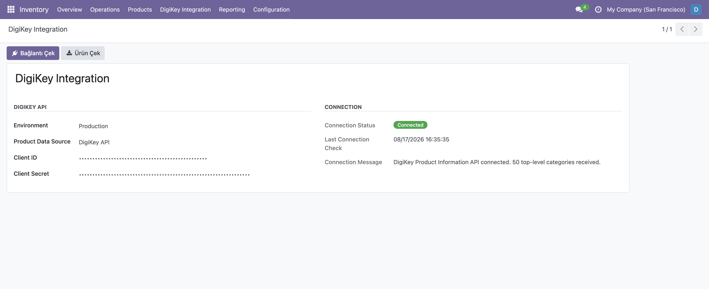
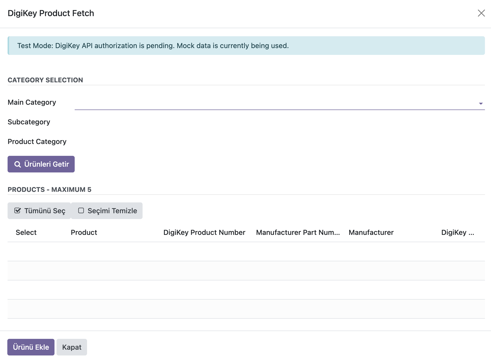
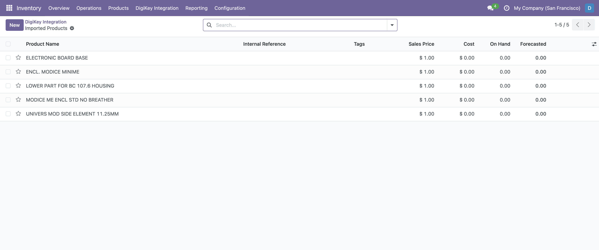
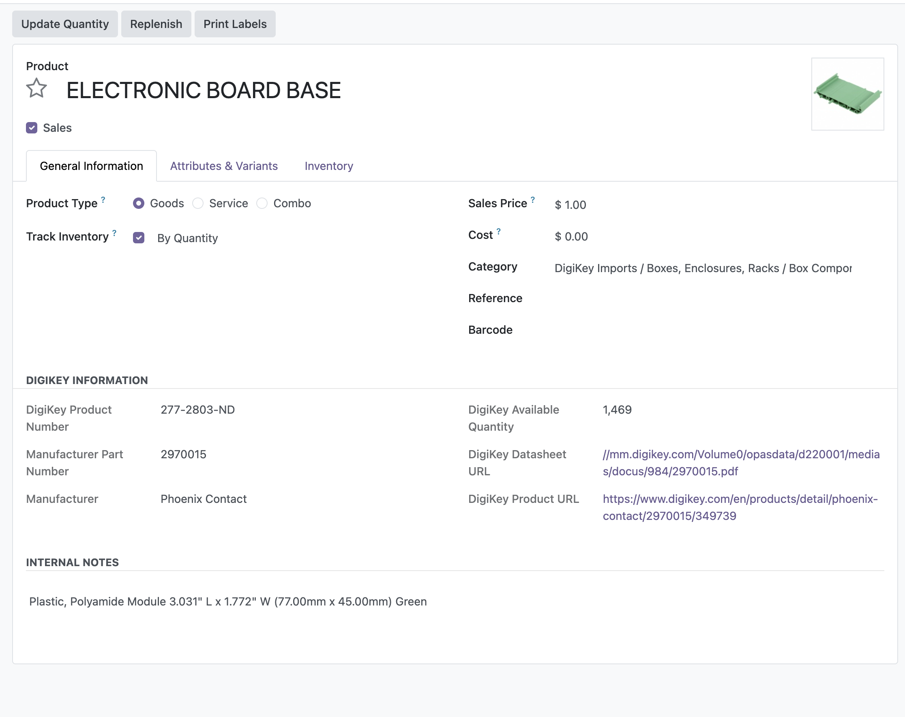
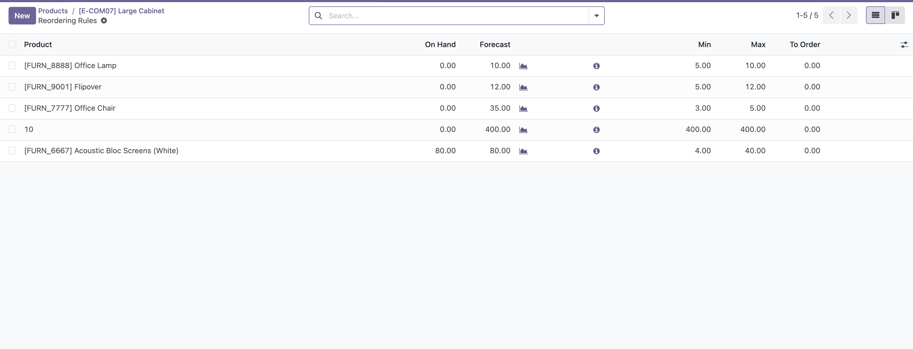
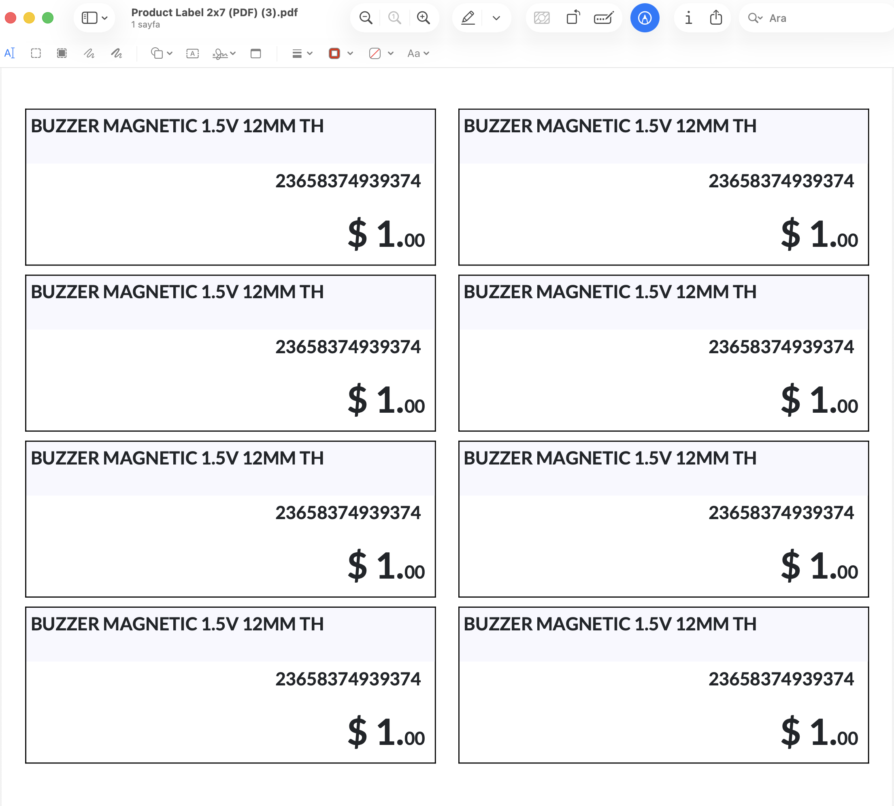

# DigiKey Inventory Connector - Kullanım Rehberi

## 1. Genel Bakış

Bu modül, DigiKey ürün katalogundan ürünleri çekip Odoo içinde işlem yapmanızı sağlar. Ana akış şunlardır:

1. Kategori seçimi yapılır.
2. Ürünler DigiKey API üzerinden getirilir.
3. Ürün listesi görünür.
4. İstenilen ürünler seçilir.
5. Seçili ürünler Odoo ürünü olarak aktarılır.

---

## 2. Modülün Açılması

Odoo arayüzünde ilgili menü veya wizard üzerinden DigiKey Product Fetch ekranı açılır.

---

## 3. DigiKey API Bağlantısı

DigiKey Integration ekranında API bağlantı bilgileri tanımlanır.

Bilgiler kaydedildikten sonra **Bağlantı Çek** butonuna basılır.

---

## 4. DigiKey’den Ürün Arama

Kullanıcı ana kategori, alt kategori ve ürün kategorisini seçer.

---

## 5. Ürünleri Getirme

Sistem seçilen kategoriye ait en fazla 5 ürünü listeler.

"Ürünleri Getir" butonuna basıldığında:

- Seçili kategoriye göre DigiKey API çağrısı yapılır.
- Maksimum 5 ürün listelenir.
- Ürün satırları ekranda görüntülenir.

---

## 6. Ürün Seçimi

Ürün listesi üzerinde her satır için `selected` alanı bulunur.

Butonlar:

- Tümünü Seç: tüm satırları tek tıkla seçer.
- Seçimi Temizle: tüm seçimleri kaldırır.

Bu sayede birden fazla ürün hızlıca işaretlenebilir.

---

## 7. Odoo’ya Aktarılan Bilgiler

Aktarılan ürün Odoo'nun standart ürün kartında oluşturulur.

Sistem şu işlemleri yapar:

- Seçili ürünler kontrol edilir.
- Zaten mevcut ürünler atlanır.
- Yeni ürünler `product.template` olarak oluşturulur.
- Kategori hiyerarşisi otomatik olarak oluşturulur.
- Ürün bilgileri DigiKey verilerinden alınır.

---

## 9. Reordering Rules

Stok yenileme kuralları burada tanımlanabilir ve gözden geçirilebilir.

---

## 10. Etiket PDF Çıktısı

Ürünler için barkodlu etiket ve PDF çıktısı oluşturulabilir.

---

## 11. Aktarılan Ürün Bilgileri

Her ürün için aşağıdaki bilgiler korunur:

- Ürün adı
- DigiKey ürün numarası
- Üretici parça numarası
- Üretici
- Stok miktarı
- Açıklama
- Datasheet linki
- Ürün linki
- Görsel URL

---

## 12. Önemli Notlar

- API çağrısı için kategori doğru seçilmelidir.
- Listelenen ürün sayısı maksimum 5 ile sınırlıdır.
- Mevcut ürünler tekrar oluşturulmaz.
- Seçilen ürünlerden en az biri olmalıdır.

---

## 13. Hata Durumları

Aşağıdaki durumlar kullanıcıya hata olarak gösterilebilir:

- Kategori seçilmemişse
- Ürün bulunamazsa
- Hiçbir ürün seçilmemişse
- Seçilen ürünler zaten mevcutsa

---

## 14. Destek / Geliştirme

Bu modül, DigiKey API entegrasyonu ve Odoo ürün aktarımı için geliştirilmiştir. Gerekli güncellemeler ve yeni alanlar eklenerek iş akışı genişletilebilir.
